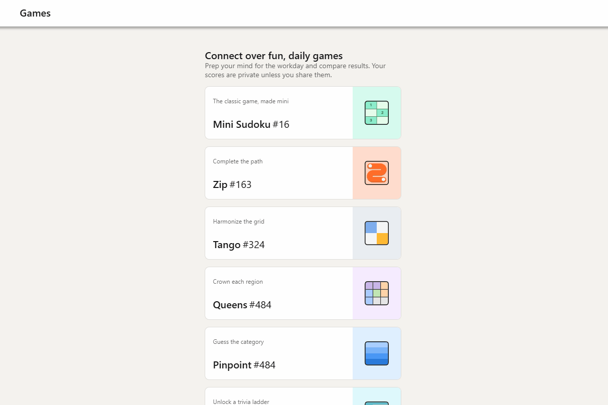

# LinkedIn Queens Solver


A Chrome extension that automatically solves the daily 'Queens' puzzle game on LinkedIn with **universal compatibility**. Works seamlessly for both **signed-in users** (direct DOM access) and **signed-out users** (iframe-based game loading). The extension uses an optimized backtracking algorithm to handle the game's unique constraints, including colored regions and queen adjacency rules, providing instant solutions with visual guidance directly on the LinkedIn game page.

## 🚀 Universal Compatibility

✅ **Signed-In Users** - Direct game board access and immediate solving  
✅ **Signed-Out Users** - Smart iframe detection and cross-frame puzzle solving  
✅ **All LinkedIn Game Modes** - Automatically adapts to different LinkedIn game presentations  
✅ **SPA Navigation** - Seamless operation across LinkedIn's single-page application routing

## Demo


*Animated demonstration of the LinkedIn Queens Solver extension in action*

## 🤖 Tech Stack

- **JavaScript (ES6+)** - Core logic and algorithm implementation
- **Chrome Extension APIs (Manifest V3)** - Modern extension framework with enhanced security
- **HTML5** - Extension popup interface structure
- **CSS3** - Visual styling and highlighting effects
- **DOM Manipulation** - Real-time LinkedIn page interaction and solution visualization

## ✨ Features

- **Universal Compatibility** - Works for both signed-in and signed-out LinkedIn users with automatic context detection
- **Smart Iframe Support** - Seamlessly handles LinkedIn's iframe-based game loading for signed-out users
- **Automated Board Parsing** - Automatically detects and extracts LinkedIn Queens game state via sophisticated DOM analysis
- **Custom Backtracking Algorithm** - Implements optimized solving algorithm respecting LinkedIn's unique rules (color regions, adjacency constraints)
- **Dynamic Solution Visualization** - Injects subtle visual highlights and crown icons directly onto the live game board
- **Instant Performance** - Solves 9x9 puzzles in under 1ms with ~49 iterations using O(1) conflict checking
- **SPA Navigation Support** - Seamlessly works across LinkedIn's single-page application routing with context awareness
- **Intelligent Context Detection** - Automatically identifies execution environment (main page vs iframe) and adapts accordingly
- **User-Friendly Interface** - Clean browser action popup with solution status and performance metrics

## ⚙️ Installation and Usage

### 📦 Method 1: Download Release (Recommended)
1. **Download the latest release** from [GitHub Releases](https://github.com/XaJason/linkedin-queens-solver/releases)
2. **Extract the ZIP file** to a local directory
3. **Open Google Chrome** and navigate to `chrome://extensions`
4. **Enable "Developer mode"** using the toggle in the top right corner
5. **Click "Load unpacked"** and select the extracted extension folder
6. **Visit LinkedIn Queens** - the extension will automatically solve puzzles!

### 🔧 Method 2: Clone Repository (Development)
1. **Clone the repository:**
   ```bash
   git clone https://github.com/XaJason/linkedin-queens-solver.git
   ```
2. **Open Google Chrome and navigate to `chrome://extensions`**
3. **Enable "Developer mode" using the toggle in the top right corner**
4. **Click the "Load unpacked" button**
5. **Select the `/extensions` directory from the cloned project folder**
6. **Navigate to a LinkedIn Queens puzzle page and the extension will automatically solve the puzzle, displaying solutions in the console and highlighting positions on the board**

### 🎯 Usage
- **Automatic Operation**: Simply visit any LinkedIn Queens puzzle page
- **Universal Compatibility**: Works whether you're signed in or signed out of LinkedIn  
- **Visual Guidance**: Solutions appear with golden highlights and crown icons
- **Console Output**: Detailed solving information available in browser developer tools

## 🏛️ Architectural Overview

The extension follows Chrome's Manifest V3 architecture with three core components working in harmony to provide **universal LinkedIn compatibility**. 

### Core Components:

- **Content Script** (`content.js`) - Features **intelligent context detection**, automatically identifying whether the game runs in direct DOM (signed-in users) or iframe mode (signed-out users). Handles DOM parsing, visual feedback, and cross-frame communication with sophisticated iframe detection algorithms.

- **Background Script** (`background.js`) - Serves as the computational engine, implementing the optimized backtracking algorithm with auxiliary data structures for O(1) conflict checking. Processes puzzle data regardless of source context (main page or iframe).

- **Popup Script** (`popup.js`) - Provides user interface controls and status information with context-aware feedback.

### Universal Compatibility Architecture:

The extension automatically detects LinkedIn's game loading strategy:
- **Direct Mode (Signed-In)**: Game board exists directly on main page DOM
- **Iframe Mode (Signed-Out)**: Game loads within `linkedin.com/games/view/queens/desktop` iframe

Communication flows through Chrome's secure message passing protocol, with the content script intelligently adapting to either context while maintaining full functionality and respecting LinkedIn's security boundaries.

## 📜 License

Distributed under the MIT License. See [LICENSE](LICENSE) for more information.
